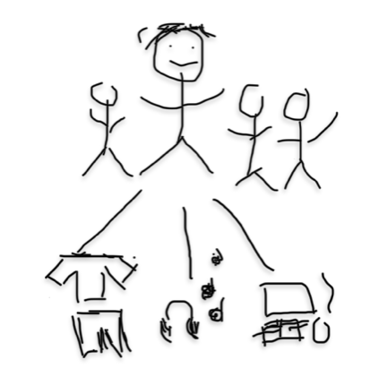

<head>

</head>
<body>

  <a href="{{site.baseurl}}/" style="margin-right: 10px">Home</a>
  <!-- <a href="{{site.baseurl}}/planning" style="margin-right: 10px">Planning</a> -->
  <a href="{{site.baseurl}}/clothes/home" style="margin-right: 10px">Clothes</a>
  <a href="{{site.baseurl}}/verify" style="margin-right: 10px">Verify</a>
  <a href="{{site.baseurl}}/hacks" style="margin-right: 10px">Hacks</a>

<!-- <iframe style="border-radius:12px" src="https://open.spotify.com/embed/playlist/6MXWK7edsydhiPEs07RDkO?utm_source=generator&theme=0" width="100%" height="352" frameBorder="0" allowfullscreen="" allow="autoplay; clipboard-write; encrypted-media; fullscreen; picture-in-picture" loading="lazy"></iframe> -->

  
  <h3>In my freeform diagram, I drew my family and I. I also drew clothes because I like finding new pieces to wear, headphones becasue I like listening to music, and a gaming setup because I like playing games.</h3>

  <h3>Here are my classes for trimester 1</h3>
  <ol>
    <li>AP CSA</li>
    <li>AP Stats</li>
    <li>Chinese</li>
    <li>AP Physics</li>
    <li>APEL</li>
  </ol>

  
1 / 3

  
  
lucki

  
2 / 3

  
  
grentperez

  
3 / 3

  
  
wave to earth

<a class="prev" onclick="plusSlides(-1)">❮</a>
<a class="next" onclick="plusSlides(1)">❯</a>

 

   
   
   

</body>
